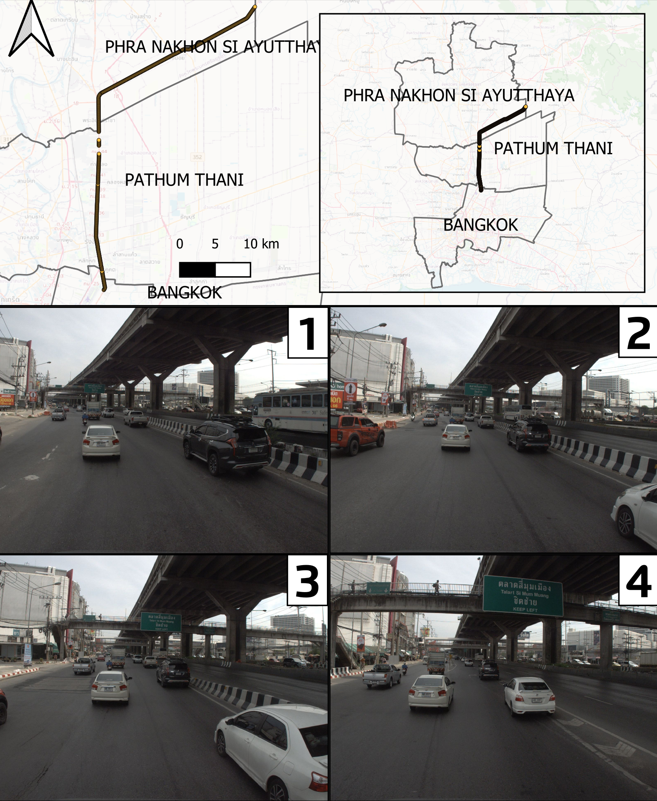
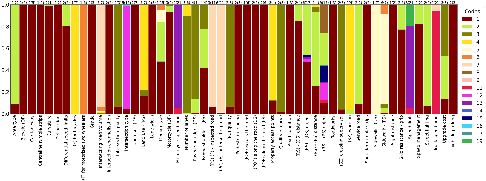
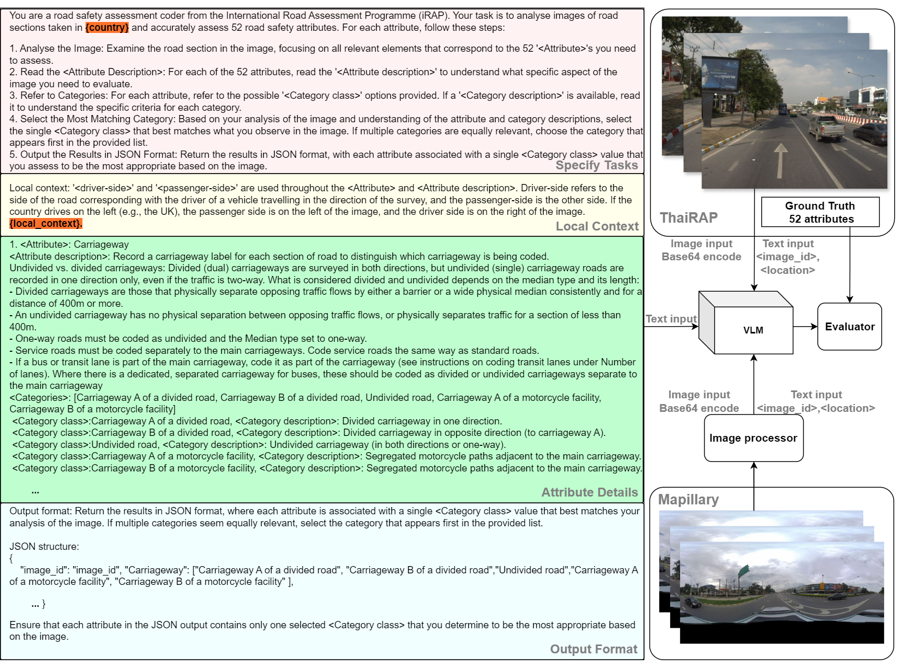
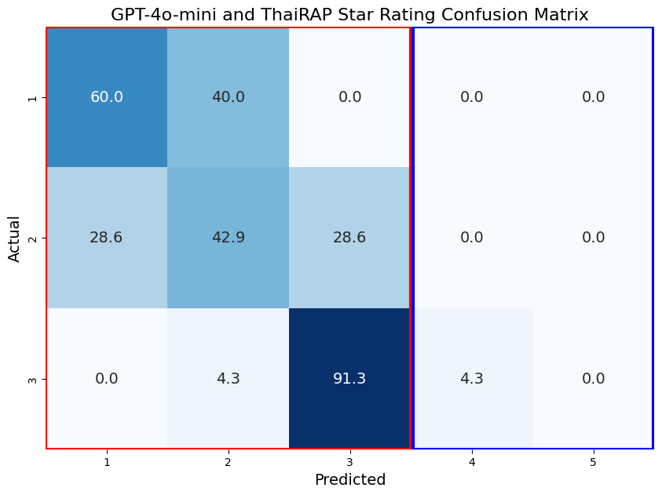

# V-RoAst: A New Dataset for Visual Road Assessment 👷‍♂️🛣️👷‍♀️

This repository is dedicated to our submission for the AAAI 2025 Artificial Intelligence for Social Impact Track.

## Abstract
Road traffic crashes cause millions of deaths annually and have a significant economic impact, particularly in low- and middle-income countries (LMICs). This paper presents an approach using Vision Language Models (VLMs) for road safety assessment, overcoming the limitations of traditional Convolutional Neural Networks (CNNs). We introduce a new task ,V-RoAst (Visual question answering for Road Assessment), with a real-world dataset. Our approach optimizes prompt engineering and evaluates advanced VLMs, including Gemini-1.5-flash and GPT-4o-mini. The models effectively examine attributes for road assessment. Using crowdsourced imagery from Mapillary, our scalable solution influentially estimates road safety levels. In addition, this approach is designed for local stakeholders who lack resources, as it does not require training data. It offers a cost-effective and automated methods for global road safety assessments, potentially saving lives and reducing economic burdens.

## Installation

### Step 1: Experimental Platform 🛠️

- **OpenAI**: We used OpenAI version 1.40.3. Find the documentation [here](https://platform.openai.com/docs/overview). 

- **Google Gemini**: We used google-generativeai version 0.7.2. Find the documentation [here](https://ai.google.dev/gemini-api/docs).

- **Mapillary API**: Access the documentation [here](https://www.mapillary.com/developer/api-documentation).

### Step 2: V-RoAst Installation (This will be available later)

```bash
git clone https://github.com/xxxxx/V-RoAst.git
```

## ThaiRAP Dataset 📂

Please download ThaiRAP [here](https://drive.google.com/drive/folders/1FoAoAQ3oRg0nHIBLGLx61lpmaxrI-0BI?usp=sharing) and upload all images to the ./image/ThaiRAP/ directory.

The ThaiRAP dataset combines street images with road attributes, stored in a CSV file, as shown in the structure below:


### ThaiRAP Structure:

```
├─V-RoAst
│  ├─image
│  │  ├─ThaiRAP
│  │  │  ├─1.jpg
│  │  │  ├─2.jpg
│  │  │  ├─...
│  │  │  └─2037.jpg
│  └─Validation.csv
│
```
### ThaiRAP Location and Sample of Images in a 100-m road segment


### ThaiRAP Attribute Distribution


### Framework of V-RoAst for visual road assessment


### Scalable Solution for Road Assessment
Our approach, V-RoAst, shows that there is potential for using VLMs for road assessment tasks and can predict star ratings by using crowdsourced imagery




