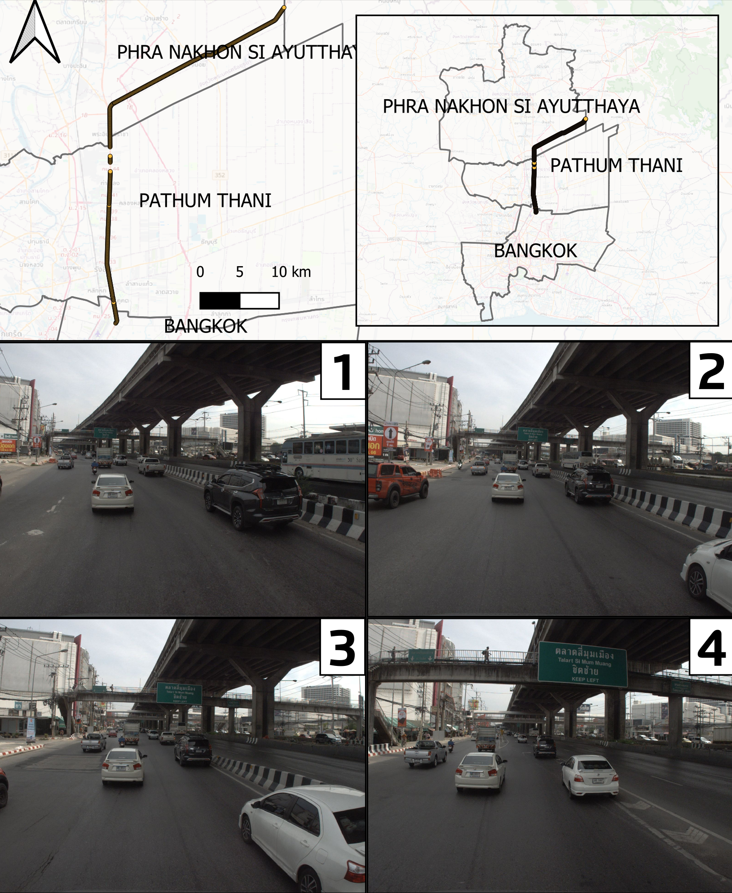
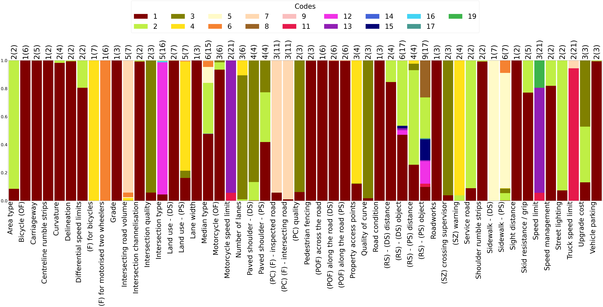
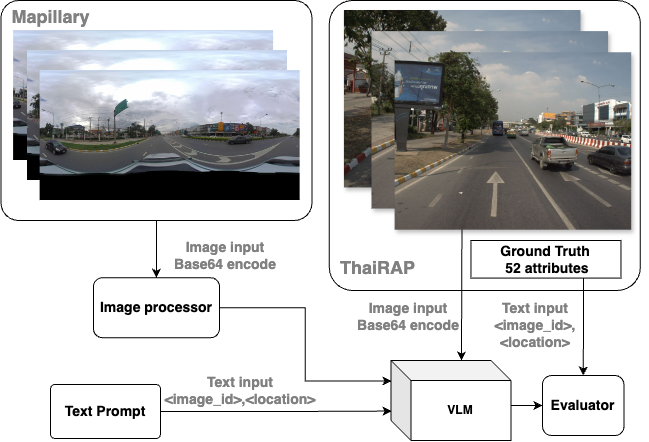
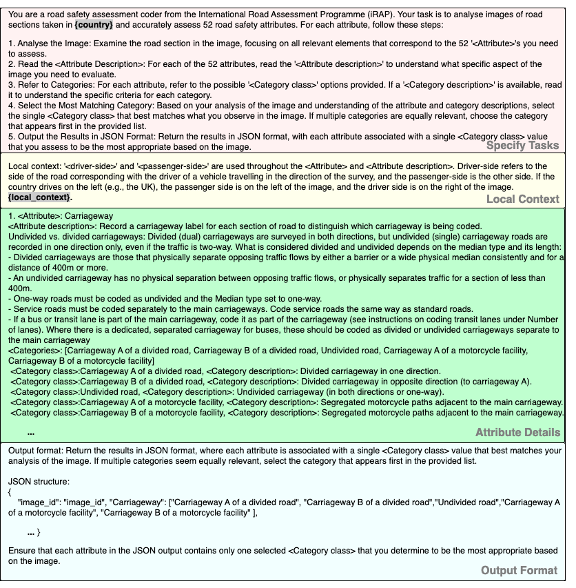
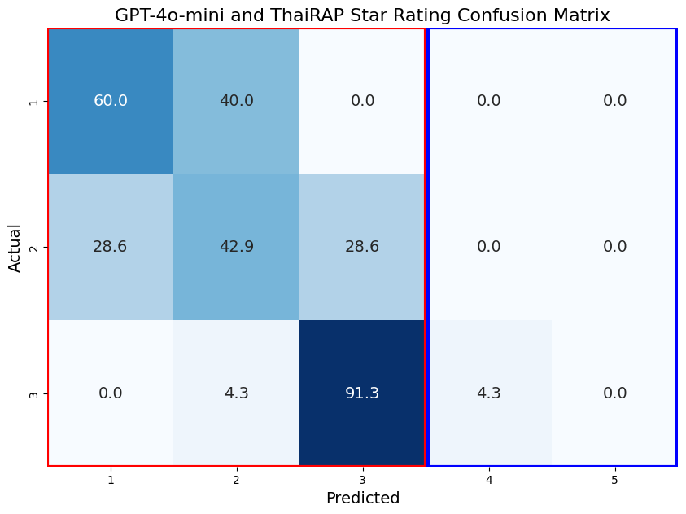

# V-RoAst: A New Dataset for Visual Road Assessment 👷‍♂️🛣️👷‍♀️

## Citation

If you use this dataset or refer to our work, please cite:

```bibtex
@misc{jongwiriyanurak2024vroastnewdatasetvisual,
  title={V-RoAst: A New Dataset for Visual Road Assessment},
  author={Natchapon Jongwiriyanurak and Zichao Zeng and June Moh Goo and Xinglei Wang and Ilya Ilyankou and Kerkritt Srirrongvikrai and Meihui Wang and James Haworth},
  year={2024},
  eprint={2408.10872},
  archivePrefix={arXiv},
  primaryClass={cs.CV},
  url={https://arxiv.org/abs/2408.10872},
}
```

## Abstract
Road traffic crashes result in millions of deaths annually and impose significant economic burdens, particularly on low- and middle-income countries (LMICs). Road safety assessments traditionally rely on human-labelled data, which is labour-intensive and time-consuming. While Convolutional Neural Networks (CNNs) have been introduced to automate these assessments, they require large labelled datasets and often necessitate retraining or transfer learning when applied to new geographic regions. This paper explores whether Vision Language Models (VLMs) can overcome these limitations to serve as effective road safety assessors using the International Road Assessment Programme (iRAP) standard. Our approach, V-RoAst (Visual question answering for Road Assessment), leverages advanced VLMs, such as Gemini-1.5-flash and GPT-4o-mini, to analyse road safety attributes without requiring any labelled training data as a downstream application. By optimising prompt engineering and utilising crowdsourced imagery from Mapillary, V-RoAst provides a scalable, cost-effective, and automated solution for global road safety assessments. Preliminary results show that VLMs achieve lower accuracy compared to CNN-based methods. However, rapid advancements in VLMs, alongside techniques such as chain-of-thought prompting and fine-tuning, offer significant opportunities for performance improvement, making VLMs a promising tool for road assessment tasks. Designed for resource-constrained stakeholders, this framework holds the potential to save lives and reduce economic burdens worldwide. 

## Installation

### Step 1: Experimental Platform 🛠️

- **OpenAI**: We used OpenAI version 1.40.3. Find the documentation [here](https://platform.openai.com/docs/overview). 

- **Google Gemini**: We used google-generativeai version 0.7.2. Find the documentation [here](https://ai.google.dev/gemini-api/docs).

- **Mapillary API**: Access the documentation [here](https://www.mapillary.com/developer/api-documentation).

### Step 2: V-RoAst Installation (This will be available later)

```bash
git clone https://github.com/PongNJ/V-RoAst.git
```

## ThaiRAP Dataset 📂

Please download ThaiRAP dataset from [(google drive)](https://drive.google.com/drive/folders/1FoAoAQ3oRg0nHIBLGLx61lpmaxrI-0BI?usp=sharing) or [(ucl rdr)](https://rdr.ucl.ac.uk/articles/figure/V-RoAst_A_New_Dataset_for_Visual_Road_Assessment/26520787?file=48277894) and upload all images to the ./image/ThaiRAP/ directory.

The ThaiRAP dataset combines street images with road attributes, stored in a CSV file, as shown in the structure below:


### ThaiRAP Structure:

```
├─V-RoAst
│  ├─image
│  │  ├─ThaiRAP
│  │  │  ├─1.jpg
│  │  │  ├─2.jpg
│  │  │  ├─...
│  │  │  └─2037.jpg
│  └─Validation.csv
│
```
### ThaiRAP Location and Sample of Images in a 100-m road segment


### ThaiRAP Attribute Distribution


### Framework of V-RoAst for visual road assessment





### Scalable Solution for Road Assessment
Our approach, V-RoAst, shows that there is potential for using VLMs for road assessment tasks and can predict star ratings by using crowdsourced imagery




